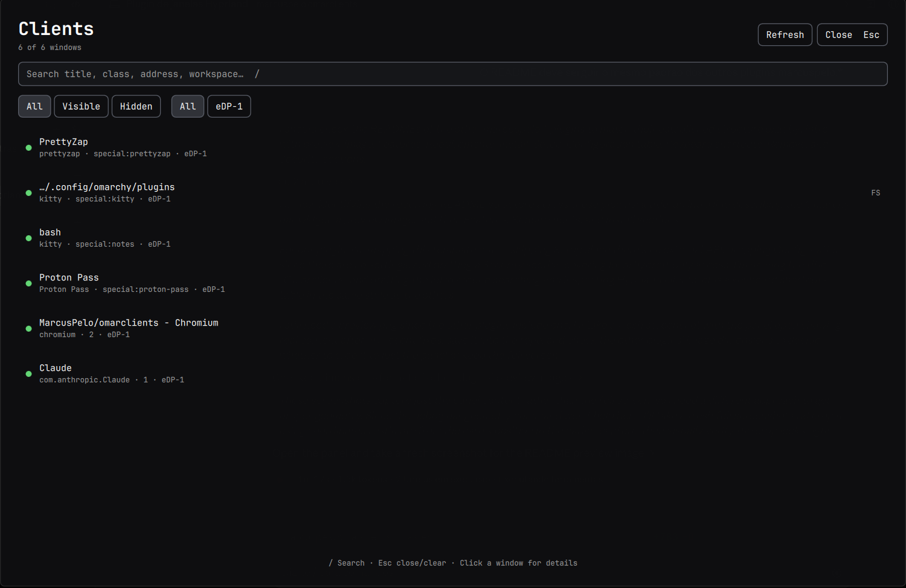

# Omarclients

An [Omarchy](https://omarchy.org/) bar widget to search and inspect Hyprland clients (windows). Opens a full-screen, centered panel — filter by visibility and monitor, drill into every raw `hyprctl clients` field for the selected window, and focus or close it on the spot.



## Features

- **Full-screen centered panel** — same overlay pattern as other Omarchy panel plugins
- **Search** — filter live by title, class, address or workspace
- **Visible filter** — three states: All / Visible / Hidden
- **Monitor filter** — one button per currently connected monitor, built automatically
- **Full detail view** — every raw field from `hyprctl clients` for the selected window (address, mapped, visible, at, size, workspace, floating, monitor, class, title, initialClass, initialTitle, pid, pinned, fullscreen, fullscreenHandler, grouped, tags, and any future fields Hyprland adds)
- **Focar / Fechar** — focus or close the selected window via Hyprland's dispatcher
- **Manual refresh** — data loads when the panel opens and on demand via the Refresh button; no background polling

## Requirements

- A running Hyprland session with `hyprctl` on `PATH`

## Install

```bash
omarchy plugin add https://github.com/MarcusPelo/omarclients.git
```

## Security

No network calls and no secrets are involved. Everything runs through the local `hyprctl` binary in the user's own session: reading `hyprctl -j clients` / `hyprctl -j monitors`, and dispatching a focus/close for the selected window's address (validated against a strict `0x[0-9a-f]+` pattern before being used).

## Keyboard shortcuts

| Key | Action |
|---|---|
| `/` | Focus the search field |
| `esc` | Clear the search field, then close the panel |

## Remove

```bash
omarchy plugin remove marcuspelo.omarclients
```

## License

MIT
